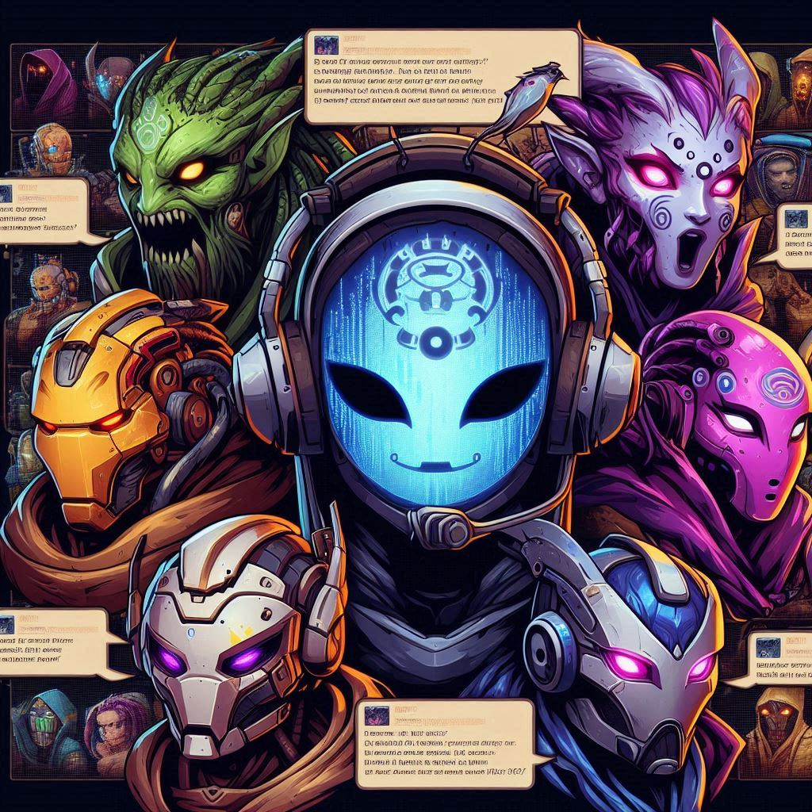
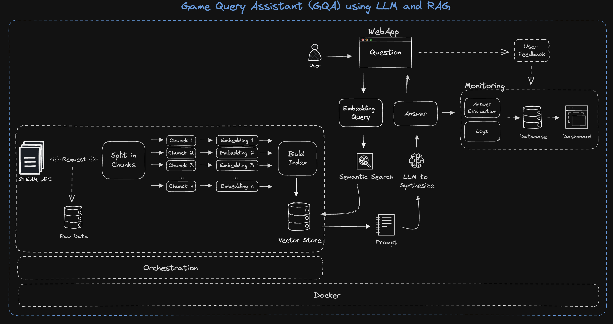
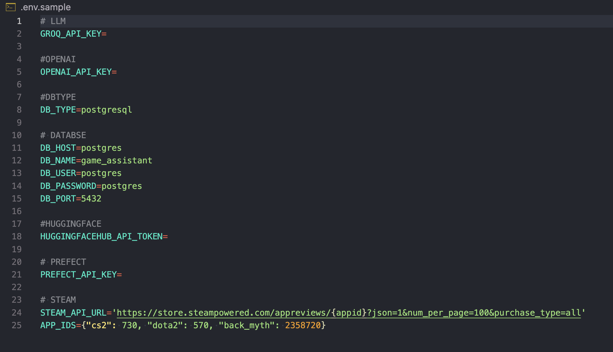
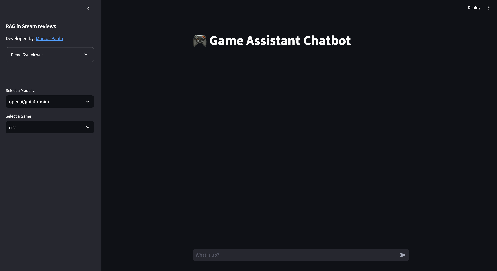
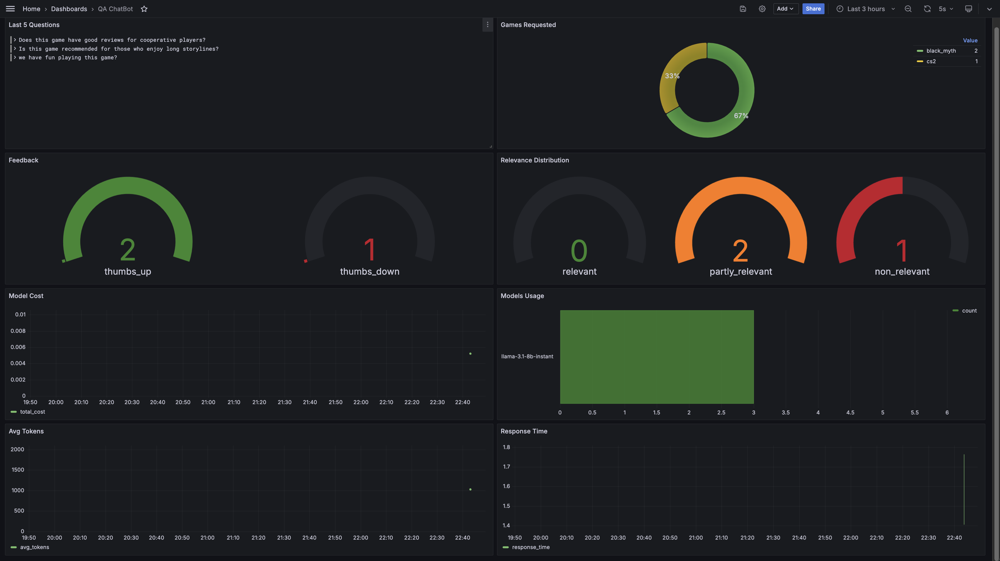

# Game Query Assistant (GQA) using LLM and RAG




**Game Query Assistant (GQA)** is a chatbot designed to assist players with their queries about video games by leveraging insights from reviews written by other players. By combining **Large Language Models (LLM)** and **Retrieval-Augmented Generation (RAG)** techniques, GQA formulates precise and contextually relevant responses based on real-time feedback extracted from the Steam platform.

## Architecture



## Features
- **Natural Language Understanding**: Utilize the power of LLM to understand player queries and deliver personalized responses.
- **RAG Framework**: Combine LLM with a retrieval system to enhance the accuracy of responses by fetching relevant data from a vectorized knowledge base of player reviews.
- **Steam Reviews Integration**: Seamlessly fetch player reviews through the Steam API for analysis and information extraction.
- **Real-time Insights**: Provide responses based on up-to-date reviews from actual players, allowing gamers to make informed decisions.

## Technologies Used

- **Python**: Core programming language for the backend and chatbot logic.
- **Jupyter Notebook**: For experiments.
- **PostgreSQL**: Database to store and manage data related to the game reviews and user interactions.
- **ChromaDB**: Vector database for indexing and searching reviews based on semantic similarity using embeddings.
- **Prefect**: Workflow orchestration tool for automating tasks such as review collection, processing, and updating the knowledge base.
- **Grafana**: Monitoring and visualization tool used to track performance metrics and monitor the system’s health.
- **Docker**: Containerization platform used to bundle the application for easy deployment and scalability.
- **Streamlit**: Web-based user interface for interacting with the chatbot.

## How it Works

1. **Steam Review Collection**: 
   - Reviews are gathered from the Steam API for various games and stored in a database (Postgres).
   - Using ChromaDB, these reviews are transformed into vector representations, allowing efficient similarity searches when answering player queries.

2. **Query Processing**:
   - A user asks a question via the **Streamlit**-based interface.
   - The question is parsed and processed by the **LLM**, which formulates a response based on the retrieved data.
   
3. **Retrieval-Augmented Generation**:
   - The **RAG** technique is employed, where the LLM retrieves the most relevant reviews from **ChromaDB** (vector search).
   - Based on these reviews, the LLM refines and generates a final response, providing relevant insights from experienced players.

4. **Visualization & Monitoring**:
   - **Grafana** is used to monitor the performance of the system, track the API usage, and gather metrics on response time, relevant answers, and more.

## Installation

### Prerequisites
- [Docker](https://www.docker.com/products/docker-desktop/)
- [Python 3.11+](https://www.python.org/downloads/)
- [Huggingface](https://huggingface.co/) Key
- [Groq](https://console.groq.com/keys) or [OpenAI](platform.openai.com) Key
- [Make]((https://gnuwin32.sourceforge.net/packages/make.htm)) (If you want to use the commands in the Makefile)

### Setup

1. Clone the repository:
   ```bash
   git clone https://github.com/marcosppaiva/llm_final_project.git
   cd llm_final_project
   ```

2. Set up the environment:
   ```bash
   python -m venv venv
   # Mar or Linux
   source venv/bin/activate
   # Windows
   venv/Scripts/activate
   
   pip install -r requirements_dev.txt
   ```

3. Configure the environment
* rename .env.sample file
   ```bash
   make rename_env_file
   ```
* open the .env file and add your acess keys.


4. Run the Docker container:
   ```bash
   docker compose up -d
   # or you can use make
   make docker-run
   ```

5. Deploy into Prefect Cloud or Run Locally
* This command will deploy your flows into Prefect Cloud and creat a worker-pool

* After executing this command the terminal is blocked since we have activated a worker-pool. Open another terminal to continue. Remember to enable virtualenv in new terminal
   ```bash
   make prefect-cloud

   # In another therminal (remember to activate the virtual environment)
   make prefect-run
   ```


* If you want run locally
   ```bash
   # This will block the terminal
   make prefect-local

   # In another therminal (remember to activate the virtual environment)
   make review-download
   ```

* After having collected the reviews, we can now use the application


## Usage
### Chatbot Interface

After setup, navigate to the **Streamlit** interface.

Start asking questions about any video game that has reviews on Steam, and the chatbot will provide relevant insights from other players.

### Monitoring

**Grafana** is set up to monitor and visualize system metrics.

You can customize dashboards to track query response time, API performance, and other metrics.

### Services
| Service               | IP                      |
|:----------------------|:----------------------- |
| streamlit interface   | http://localhost:8501/  |
| grafana               | http://localhost:3000/  |
| pgAdmin               | http://localhost:16543/ |


## Experiments

For experiments, we use Jupyter notebooks.
They are in the [`notebooks`](notebooks/) folder.

To start Jupyter, run:

```bash
# Remember to activate the virtual environment
cd notebooks
jupyter notebook
```

We have the following notebooks:

- [`RAG-TEST.ipynb`](notebooks/RAG-TEST.ipynb): Experiments with RAG system.
- [`gen-evaluation-ground-truth.ipynb`](notebooks/gen-evaluation-ground-truth.ipynb): Generating the ground truth dataset for retrieval  evaluation and the evaluation.

## Retrieval Evaluation

During the development of the **Game Query Assistant (GQA)**, a process for evaluating the **RAG** (Retrieval-Augmented Generation) system was implemented to measure the accuracy of the responses generated by the model based on Steam game reviews. However, we observed that the evaluation metrics were lower than expected, and there are a few reasons that explain this behavior.

### Evaluation Method

To measure the system’s effectiveness, a **ground truth dataset** was created using a **LLM**. For each game review, the model generated up to 5 possible questions related to the content of that review. The idea behind this approach was to compare whether the answers provided by GQA were taking into account the review that originally generated the question.

The basic approach - using `chromadb` as default:

- Hit rate: 46%
- MRR: 25%

The improved version (with chunk data):

- Hit rate: 46%
- MRR: 29%

### Issue Identified

One of the main challenges identified during the evaluation was the fact that, for a given question, **there may be more than one review containing an adequate answer**. This results in lower accuracy metrics when directly comparing the model's answer to the specific review associated with the question.

The issue arises because the system may be retrieving a correct or relevant answer, but based on a different review than the one that originally generated the question. As a result, traditional quantitative comparison metrics do not correctly reflect the model’s performance, as it may be providing valid information but from another review.

### Potential Improvements

To improve the system evaluation and boost accuracy metrics, one approach would be to **group similar reviews**. Instead of generating questions based on individual reviews, these questions could be generated from **clusters of semantically similar reviews**. This would ensure that the question covers a broader range of possible answers, minimizing the impact of the problem where multiple reviews are relevant.

This approach would allow the model to generate more comprehensive answers that align with the set of reviews that generated the question, resulting in a fairer comparison and better reflecting the actual performance of the RAG.


## Future Improvements

- **Multilingual Support**: Enable the system to handle reviews and queries in multiple languages.

- **Game Recommendation System**: Suggest games based on a player’s preferences inferred from their queries.

- **Improved Metrics for RAG Evaluation**: Implement a method to group similar reviews for question generation. By clustering semantically related reviews, the system can generate questions that encompass multiple potential answers, reducing the likelihood of incorrect evaluations due to multiple valid reviews. This would allow more accurate measurement of the RAG model's performance and better reflect its real-world effectiveness.